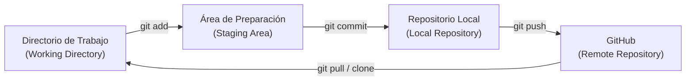

# Guía de Inicio: Git y GitHub en Windows

Esta guía te ayudará a configurar y comenzar a utilizar **Git** y **GitHub** en tu sistema Windows como tus herramientas de control de versiones.

---

## 1. Instalación de Herramientas

Dado que tienes la herramienta `winget` disponible en tu terminal de Windows, puedes instalar Git y la interfaz de comandos de GitHub (GitHub CLI) de forma rápida y sencilla.

### Instalar Git
Ejecuta el siguiente comando en tu terminal (PowerShell o CMD) para instalar Git:
```powershell
winget install --id Git.Git -e --source winget
```

### Instalar GitHub CLI (Opcional pero muy recomendado)
GitHub CLI (`gh`) facilita enormemente la autenticación y la gestión de repositorios directamente desde la terminal sin lidiar con tokens manuales o claves SSH complejas:
```powershell
winget install --id GitHub.cli -e --source winget
```

> [!NOTE]
> Después de realizar las instalaciones, es necesario **reiniciar tu terminal** o editor de código (como VS Code) para que reconozca los nuevos comandos.

---

## 2. Configuración Inicial de Git

Una vez instalado Git y reiniciada la terminal, configura tu identidad. Esto es necesario porque cada confirmación (commit) de Git utiliza esta información:

```powershell
# Configura tu nombre (puede ser tu nombre real o de usuario)
git config --global user.name "Tu Nombre"

# Configura tu correo electrónico (debe ser el mismo de tu cuenta de GitHub)
git config --global user.email "tu_correo@ejemplo.com"
```

Puedes verificar que la configuración se aplicó correctamente con:
```powershell
git config --list
```

---

## 3. Autenticación con GitHub

Para subir tu código a GitHub, necesitas identificarte.

### Opción A: Autenticación con GitHub CLI (La forma más fácil)
Si instalaste GitHub CLI (`gh`), simplemente ejecuta:
```powershell
gh auth login
```
Sigue las instrucciones en pantalla:
1. Selecciona `GitHub.com`.
2. Elige `HTTPS` como protocolo preferido.
3. Selecciona `Yes` para autenticarte con tus credenciales de GitHub.
4. Elige `Login with a web browser`. Te dará un código de un solo uso (por ejemplo, `WD38-34DF`) y abrirá tu navegador para que inicies sesión y lo pegues.

### Opción B: Usar HTTPS con un Token de Acceso Personal (PAT)
Si prefieres no usar el CLI, cuando intentes subir cambios por primera vez (a través de `git push`), Windows te mostrará una ventana emergente del Administrador de Credenciales para iniciar sesión en tu cuenta de GitHub mediante el navegador.

---

## 4. El Flujo de Trabajo en Git

Git organiza el ciclo de vida del código en cuatro áreas principales. Aquí tienes un flujo visual de cómo interactúan:



### Comandos Esenciales en el Día a Día

| Comando | Descripción |
| :--- | :--- |
| `git init` | Inicializa un nuevo repositorio Git local en la carpeta actual. |
| `git status` | Muestra el estado de los archivos (cuáles han cambiado, cuáles están listos para ser guardados). |
| `git add <archivo>` | Agrega archivos específicos al *Staging Area* (preparación). Usa `git add .` para agregar todo. |
| `git commit -m "Mensaje"` | Guarda los cambios preparados en tu historial local con un mensaje descriptivo. |
| `git push` | Sube los cambios de tu repositorio local al servidor remoto en GitHub. |
| `git pull` | Trae y fusiona los últimos cambios desde GitHub a tu carpeta local. |
| `git clone <URL>` | Descarga una copia de un repositorio existente de GitHub a tu máquina. |

---

## 5. Tu Primer Repositorio (Paso a Paso)

Sigue estos pasos para subir tu primer proyecto a GitHub desde cero:

1. **Crea una carpeta para tu proyecto y entra en ella:**
   ```powershell
   mkdir mi-primer-proyecto
   cd mi-primer-proyecto
   ```

2. **Inicializa el repositorio Git:**
   ```powershell
   git init
   ```

3. **Crea un archivo de prueba:**
   ```powershell
   echo "# Mi Primer Proyecto" > README.md
   ```

4. **Revisa el estado y prepara el archivo:**
   ```powershell
   git status
   git add README.md
   ```

5. **Confirma el cambio localmente:**
   ```powershell
   git commit -m "Primer commit: agregar README"
   ```

6. **Crea el repositorio remoto en GitHub:**
   - Si usas **GitHub CLI**, puedes crearlo directamente desde la terminal con:
     ```powershell
     gh repo create mi-primer-proyecto --public --source=. --remote=origin --push
     ```
   - Si prefieres la **página web de GitHub**:
     1. Ve a [github.com](https://github.com) y crea un nuevo repositorio llamado `mi-primer-proyecto` (déjalo vacío, sin README ni .gitignore).
     2. GitHub te dará unos comandos para enlazar tu repositorio local. Copia y ejecuta los siguientes en tu terminal:
        ```powershell
        # Cambiar el nombre de la rama principal a 'main'
        git branch -M main
        
        # Enlazar tu carpeta local con el repositorio en la web
        git remote add origin https://github.com/TU_USUARIO/mi-primer-proyecto.git
        
        # Subir tus cambios
        git push -u origin main
        ```

¡Listo! Tu código ahora estará seguro y visible en tu perfil de GitHub.
